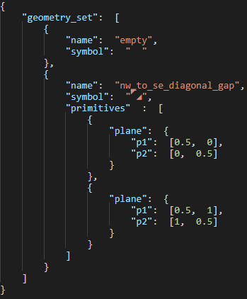

# Maps
A map is composed of geometric tiles, each associated with a material.
A geometric tile is composed of a set of geometric primitives: plane, cylinder etc.
Materials give the surfaces of the tiles both their texture and their properties.

To construct a map, we need two map files: a geometry map file and a material map file.

## the assets directory
The `assets/` directory is organized as follows:
```
├───geometry_sets
│       default_geo_set.json
│       
├───maps
│   └───42
│           geometry_map.json
│           material_map.json
│
├───material_sets
│   │   default_mtl_set.json
│   │   
│   └───textures
|           default.png
│           absorbent.png
│           reflective.png
│           refractive.png
│           transmissive.png
│
├───portal_symbol_sets
│       default_portal_symbols.json
|
├───skybox
│       sky_texture.png
|
└───spawn_symbol_sets
        default_spawn_symbols.json
```

## geometry sets
Geometry sets are json files containing a set of geometric tiles, and are located in the `assets/geometry_sets/` directory.



As you can see, the data fields for a geometric tile are:
* (required) **"name"**: the name of the geometric tile.
* (required) **"symbol"**: the associated symbol that will be used in the geometry map.
* (optional) **"primitives"**: the set of geometric primitives that compose the tile.

The "primitives" field contains primitive geometries such as:
* **"plane"**: a one-sided plane. It contains 2 points, p1 and p2, which are the extremities of the plane.
* **"cylinder"**: a cylinder which contains a **"radius"**.

The points are coordinates within the tile:
```
(0;0)____ 
 |       |
 |       |
 |____(1;1)
```

When adding a plane to a geometric tile, it can face 2 possible directions.  
To know which direction your plane will face, follow these simple steps:
* Trace an arrow from p1 to p2.
* Turn the arrow 90 degrees counter clockwise.

The resulting arrow indicates the direction your plane will face in game. That direction is called the normal of the plane. To switch the normal of your plane, simply swap p1 and p2 in the json file.

### example:

```
   "plane": {           |     "plane": {
     "p1": [0.5, 1],    |       "p1": [0.5, 0],
     "p2": [0.5, 0]     |       "p2": [0.5, 1] 
   }                    |     }
                        |
                        |
           p2           |             p1
           |            |             |				
        <--|            |             |-->
           |            |             |
           p1           |             p2
```

## material sets
Material sets are json files containing a set of materials, and are located in the `assets/material_sets/` directory.


The following fields indicate the data required by a material:
* (required) **"name"**: the name of your material.
* (required) **"symbol":** the associated symbol that will be used in the material map.
* (required) **"properties":** the properties of the material.
* (required) **"texture":** or **"color"**: the texture or color of the material.

The **"properties"** field contains the **"physical_properties"** field, whose value indicates the physical type of the material.
So far we support 4 types of physical properties for our materials:
* **reflective**: a material that reflects projectiles.
* **refractive**: a material that refracts projectiles.
* **transmittive**: a material that does not deviate projectiles.
* **absorbent**: a material that absorbs projectiles.

The value of a **"texture"** field is the name of a texture file located in the `assets/material_sets/textures/` folder.
Currently, the supported image formats are the ones supported by the SDL2 library: PNG, JPEG, BMP, GIF, PCX, PNM, SVG, TGA, TIFF, WEBP, XCF, XPM, XV.


The value of a **"color"** field is an hexadecimal number. The color model is RGBA (Red, Green, Blue, Alpha). The color channels are distributed as follows: **0xRRGGBBAA**. They range from 0 to 255, 0 being the lowest intensity and 255 being the highest.

### example:
  "color": "0xcf031af8" gives the color (207, 3, 26, 248)


## map files
Let's say you want to create a map called "42". To do so you must create a folder called "42" in the `assets/maps/` directory.
This folder must contain 2 json files: **`geometry_map.json`**, and **`material_map.json`**.

## geometry map file


The geometry map file contains the following fields:
* (required) **"geometry_set"**: the name of the geometry set whose geometric tiles can be used in the map.
* (required) **"spawn_symbol_set"**: the name of the spawn symbol set whose spawns can be used in the map.
* (required) **"map"**: the geometry map composed of geometric symbols and spawn symbols.  
<mark style="background-color: bisque">/!\ Its dimensions must match with those of the material map.</mark>

A spawn symbol set is a json file located in the `assets/spawn_symbol_sets/` directory. It contains the list of spawn symbols and which player spawn is associated to it:


To set a spawn in your map, simply add a spawn symbol in the geometry map.

## material map file


The material map file contains the following fields:
* (required) **"material_set"**: the name of the material set whose materials can be used in the map.
* (required) **"portal_symbol_set"**: the name of the portal symbol set whose portals can be used in the map.
* (optional) **"skybox"**: the skybox texture.
* (optional) **"previous_level"**: the name of the previous level.
* (optional) **"next_level"**: the name of the next level.
* (optional) **"bonus_level"**: the name of the bonus level.
* (required) **"map"**: the material map composed of material symbols and portal symbols.  
<mark style="background-color: bisque">/!\ Its dimensions must match with those of the geometry map.</mark>

The skybox textures are located in the `assets/skybox/` folder.

A portal symbol set is a json file located in the `assets/portal_symbol_sets/` directory. It contains the following fields:
* (required) **"previous_level_symbol"**: the symbol associated with the portal to the previous level.
* (required) **"next_level_symbol"**: the symbol associated with the portal to the next level.
* (required) **"bonus_level_symbol"**: the symbol associated with the portal to the bonus level.
* (required) **"end_symbol"**: the symbol associated with the portal to the game's ending.


To place a portal in your map, simply add a portal symbol in the material map.  
<mark style="background-color: bisque">/!\ A portal must be placed on a non-empty geometric tile.</mark>

## fonts
The symbols we use are part of a ttf (true type font) that we created.
They ease the process of creating the maps, by giving a good approximation of the final aspect/geometry, and the properties of the tiles.
To create your own maps, you can use our font, which is mainly inspired from the geometries generated by the marching squares algorithm.
However, if you need other geometric tiles, we encourage you to create a font with your own symbols. Some tools are available online to create fonts, such as [FontStruct](https://fontstruct.com/).