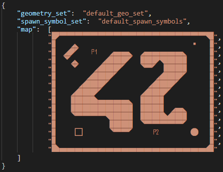

# Maps
A map is composed of geometric symbols associated with a material symbol.
Therefore, two map files are needed to create a map: one geometry map file and one material map file. The two maps need to match.

A geometric symbol describes the geometry of a tile of the map, which is a set of primitive geometries such as the one-sided plane, cylinder etc.
The symbols we use are part of a ttf (true type font) we created.
They ease the process of creating the map, by giving a good approximation of its final aspect/geometry. 
To create your own maps, you can use our font, which is mainly inspired from the geometries generated by the marching squares algorithm.
However, if you need other geometric tiles, we encourage you to create a font with your own symbols. Some tools are available online to create fonts, such as [FontStruct](https://fontstruct.com/). 

A material symbol describes the material of a tile of the map. Materials give the surfaces both their texture and their physical properties.
The material symbols are also part of the ttf we use for the geometry.
Again, if you need other materials, we encourage you to create your own material symbols in a ttf.

## the assets directory

The `assets/` directory is organized as followed:
```
├───geometry_sets
│       default_geo_set.xml
│       
├───maps
│   └───42
│           geometry_map.xml
│           material_map.xml
│
├───material_sets
│   │   default_mtl_set.xml
│   │   
│   └───textures
│           absorbent.png
│           reflective.png
│           refractive.png
│           transmissive.png
│
├───portal_symbol_sets
│       default_portal_symbols.xml
│
└───spawn_symbol_sets
        default_spawn_symbols.xml
```

## geometry sets
Geometry sets are xml files containing a set of geometric tiles, and are located in the `assets/geometry_sets/` directory.
A geometry set starts with a \<geometry_set> tag, which contains \<geometry> tags.
A \<geometry> tag describes a geometric tile:


As you can see, the \<geometry> tag contains:
* (required) \<name>: the name of your geometric tile
* (required) \<symbol>: the associated symbol that will be used in the geometric map
* (optional) \<primitives>: the geometric elements of the tile

The \<primitives> tag contains primitive geometries such as:
* \<plane>: a one-sided plane. It contains 2 \<point> tags which are the extremities of the plane. A \<point> tag contains 2D coordinates
* \<cylinder>: a cylinder which contains a \<radius> tag.

Point coordinates are in this form: (x;y)  
They describe coordinates within the tile:
```
(0;0)____  
 |       |
 |       |
 |____(1;1)
```

Consider a plane composed of first point p1 of coordinates (x1;y1) and second point p2 of coordinates (x2;y2)

The normal of the plane can have 2 directions.

The following pseudocode explains how we choose the direction of the normal:

```
let coord1, coord2;
if x1 != x2 {
	coord1 = x1;
	coord2 = x2;
} else {
	coord1 = y1;
	coord2 = y2;
}
if coord1 < coord2 {
	if the possible directions are West and East choose West, else choose the northernmost direction
}
else if coord1 > coord2 {
	if the possible directions are West and East choose East, else choose the southernmost direction
}

```

### example:

```
 <plane>                   | <plane>
 	<point>(0,5;0)</point> | 	<point>(0,5;1)</point>
 	<point>(0,5;1)</point> | 	<point>(0,5;0)</point>
 </plane>                  | </plane>
                           | 
						   |
            p1	           or           p2
            |	           |            |				
          <-|              |            |->
            |	           |            |
            p2	           |            p1

```
```
 <plane>                   | <plane>
 	<point>(0;0)</point>   | 	<point>(1;1)</point>
 	<point>(1;1)</point>   | 	<point>(0;0)</point>
 </plane>                  | </plane>
                           |
						   |
          p1               |           p2
            \  +           |             \
             \/            or            /\
              \            |            +  \
               p2          |                p1
			               |


 <plane>                   | <plane>
 	<point>(0;0)</point>   | 	<point>(1;1)</point>
 	<point>(1;1)</point>   | 	<point>(0;0)</point>
 </plane>                  | </plane>
                           |
						   |
              p2           |             p1
           +  /            |             /
            \/             or           /\
            /              |           /  +
           p1              |          p2
		                   |

```
```
 <plane>                   | <plane>
 	<point>(0;0.5)</point> | 	<point>(1;0.5)</point>
 	<point>(1;0.5)</point> | 	<point>(0;0.5)</point>
 </plane>                  | </plane>
                           |
            ^              |              
      p1____|____p2        or       p2____ ____p1
                           |              |
                           |              v
						   |
```

## material set
Material sets are xml files containing a set of material tiles, and are located in the `assets/material_sets/` directory.
A material set starts with a \<material_set> tag, which contains \<material> tags.
A \<material> tag describes a material:


The \<material> tag contains:
* (required) \<name>: the name of your material
* (required) \<symbol>: the associated symbol that will be used in the material map
* (required) \<properties>: the physical properties of the material
* (required) \<texture> or \<color>: the texture or color of your material

The \<properties> tag must contain a \<type> tag with the type of the physical property.
So far we support 4 types of physical properties for our materials:
* reflective: a material that reflects projectiles
* refractive: a material that refracts projectiles
* transmittive: a material that does not deviate projectiles
* absorbent: a material that absorbs projectiles

The \<texture> tag must contain the name of a texture file located in the `assets/material_sets/textures/` folder.
Currently, the supported image formats are the ones supported by the SDL2 library: PNG, JPEG, BMP, GIF, PCX, PNM, SVG, TGA, TIFF, WEBP, XCF, XPM, XV

The \<color> tag contains a color under this format: (r;g;b) or (r;g;b;a)
The values for each color field are between 0 and 255. If the alpha component is not indicated, the color is considered opaque (no transparency).

## map files

Let's say you want to create a map called "42". To do so you must create a directory called "42" in the `assets/maps/` directory.
This folder must contain 2 xml files: `geometry_map.xml`, and `material_map.xml`.
The dimensions of the maps must match.

## geometry map file



The geometry map file starts with a \<geometry_map> tag which contains:
* (required) \<geometry_set>: the set of geometric tiles that can be used in the map
* (required) \<spawn_symbol_set>: the set of spawn symbols that can be used in the map
* (required) \<map>: the geometric map composed of geometric symbols and spawn symbols

A spawn symbol set is an xml file located in the `assets/spawn_symbol_sets/` directory. It starts with a \<spawn_symbol_set> tag which contains the list of spawn symbols and which player spawn is associated to it:


To set a spawn in your map, simply add a spawn symbol in the geometric map.

## material map file


The material map file starts with a \<material_map> tag which contains:
* (required) \<material_set>: the set of materials that can be used in the map
* (required) \<portal_symbol_set>: the set of portal symbols that can be used in the map
* (optional) \<previous_level>: the name of the previous level
* (optional) \<next_level>: the name of the next level
* (optional) \<bonus_level>: the name of the bonus level
* (required) \<map>: the material map composed of material symbols and portal symbols

A portal symbol set is an xml file located in the `assets/portal_symbol_sets/` directory. It starts with a \<portal_symbol_set> tag which contains:
* (required) \<previous_level_symbol>: the symbol associated with the portal to the previous level
* (required) \<next_level_symbol>: the symbol associated with the portal to the next level
* (required) \<bonus_level_symbol>: the symbol associated with the portal to the bonus level
* (required) \<end_symbol>: the symbol associated with the portal to the game's end


